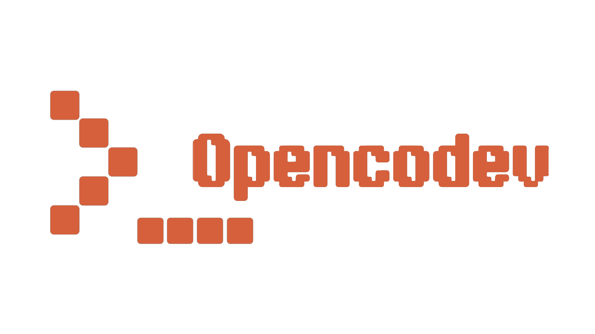

# Opencodev
[](https://discord.gg/YzD5WzrjyG)
[](https://x.com/MinenDevs)

[](https://x.com/Minenhq)

Opencodev assistant ai for everyday use, this AI can save tokens up to 70% with easy-to-understand ai answers and detailed question results.

Read more in detail in the **[Opencodev Documents](https://discord.gg/YzD5WzrjyG)**.
# What is Opencodev?

Opencodev is a CLI-based AI platform equipped with intelligent AI agents such as Gpt5, Claude Opus4, Gemini 3-5 Flash, and Openrouter. It also includes a built-in IgnesAgent (for working and coding).
Opencodev is very lightweight and can be run on Linux, Windows, and mobile devices.

# Install Opencodev
For now Opencodev is only available in the pip packages.

For mobile we are less sure about the error related issues we are less happy with for mobile.
**Windows, Linux, Mobile.**
```bash
pip install Opencodev
```
## Commands
Command feature if you have trouble running Opencodec

| Command | Description |
|----------|-------------|
| `/newchat` | Start a new conversation |
| `/history` | List all sessions |
| `/history <n>` | Switch to session `n` |
| `/clear` | Clear current session |
| `/model` | Switch AI model |
| `/connect` | Connect Telegram |
| `/status` | Show configuration and statistics |
| `/cd <path>` | Change working directory |
| `/pwd` | Show current working directory |
| `/skill list` | List installed skills |
| `/skill install <url>` | Install a skill from GitHub |
| `/skill remove <name>` | Remove an installed skill |
| `/<skill-name> [args]` | Invoke a skill directly |
| `/exit` | Exit Codev |
